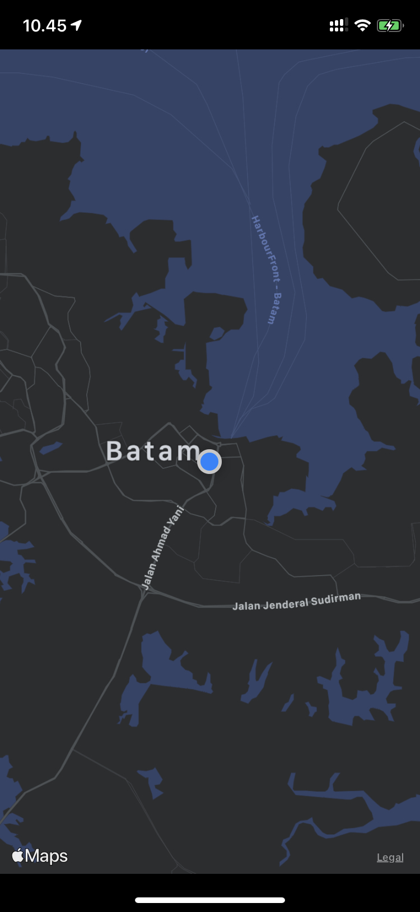

# MapKit_02_ShowUserLocation_CCLocationManager_CLLocationManagerDelegate
CCLocationManager learn from [How to Show User's Location - Swift 4.2 - Xcode 10](https://www.youtube.com/watch?v=WPpaAy73nJc&t=7s]

